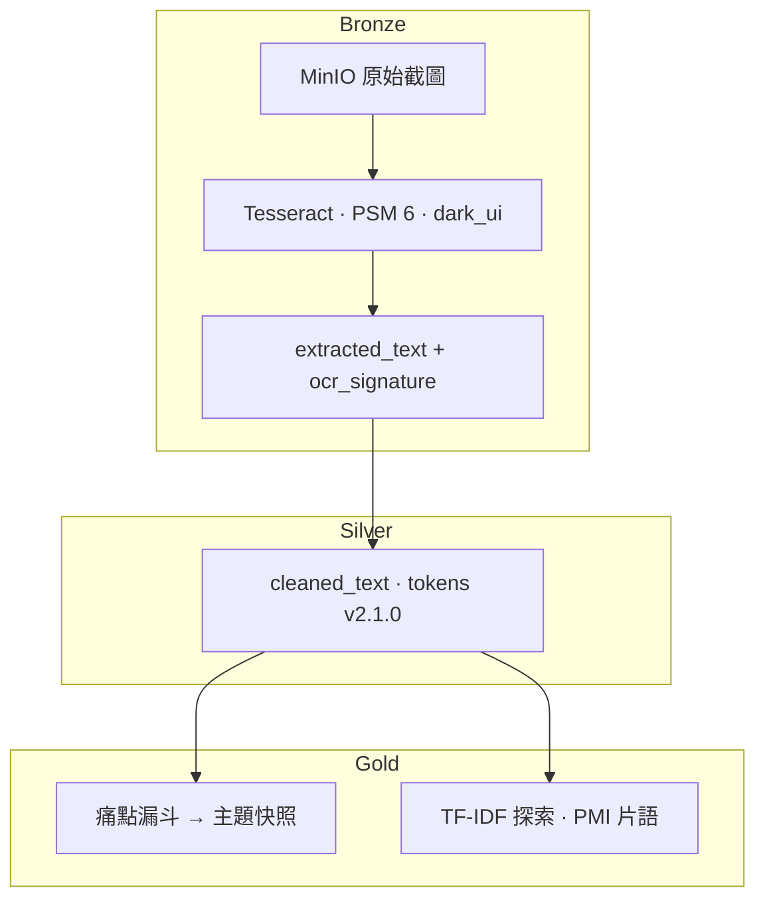

# 外送平台客訴截圖 · 商業痛點分析資料湖

OCR 結構化 **外送平台（Uber Eats、foodpanda 等）消費者客訴截圖** → **Medallion（Bronze → Silver → Gold）** → **痛點主題** 與 **規則種子探索**。技術：**Flask · PySpark · Delta Lake · MinIO · Tesseract**。

示範領域：**手搖飲／飲料店**（`dataset_id=drinks`，50 張 App 深色 UI 截圖）。管線以 `dataset_id` 設計，可擴充其他品類。

> 本 repo 目錄名 `flask_spark_delta_docker` 為歷史命名；Docker 容器名等亦可能沿用舊專案代號，不影響管線行為。

---

## 架構（摘要）



| 層級 | 做什麼 | 面試可強調 |
|------|--------|------------|
| **Bronze** | OCR 原文落盤，簽章版控 | PSM A/B 定案、broadcast 設定至 Spark executor |
| **Silver** | 清洗 + Jieba 分詞，三道品質閘門 | 銀層不套用領域停用詞（留給 Gold） |
| **Gold** | 規則式痛點分類 + 資料驅動探索 | 漏斗（撈網→過濾）與 TF-IDF **token 分流** |

**輸出怎麼看：** 首頁 **痛點主題快照** = 客訴結論；**TF-IDF** = 規則種子探索（非最終痛點）。

---

## 技術棧

Flask · PySpark 3.5 · Delta Lake 3.0 · MinIO（S3A）· Tesseract · Jieba · Docker

---

## 快速開始

1. 複製環境設定：`cp .env.example .env`（填入 MinIO 金鑰與位址）
2. 啟動（連外部 MinIO 時請改 `.env` 內 `MINIO_ENDPOINT`）：

```powershell
docker compose up --build
```

3. 開啟 **http://127.0.0.1:5000**，`dataset_id` 選 **drinks**

本機含 MinIO 一鍵示範：

```powershell
docker compose -f "docker-compose(new_minio).yml" up --build
```

管線頁：`/pipeline/bronze` → `/pipeline/silver` → `/pipeline/gold`

---

## 主要 API（精選）

| 用途 | 方法 |
|------|------|
| 健康檢查 | `GET /health` |
| Bronze OCR | `POST /delta/ocr/bronze/run` |
| Silver ETL | `POST /delta/silver/ocr/run` |
| Gold ETL | `POST /delta/gold/run?dataset_id=drinks` |
| 一鍵至金層 | `POST /delta/pipeline/to-gold/run` |
| PSM A/B（不寫 Bronze） | `GET /test/ocr-psm` |

完整路由見 `app.py`。寫入類 API 可設 `ADMIN_TOKEN`（見 `.env.example`）。

---

## 設計決策（公開摘要）

OCR 封板參數、PSM A/B 結論、分層職責與變更檢查清單：

→ **[docs/OCR-決策紀錄.md](docs/OCR-決策紀錄.md)**

---

## 專案結構（精選）

| 路徑 | 說明 |
|------|------|
| `app.py` | Flask 路由與 API |
| `services/ocr_spark.py` | Bronze OCR 與前處理 |
| `services/spark_service.py` | Spark / Delta ETL |
| `services/pain_funnel.py` | 痛點漏斗 |
| `services/text_tokens.py` | 銀層清洗與分詞 |
| `dic/` | 領域辭典（停用詞、Jieba、OCR 詞） |
| `tests/` | `pytest`（含 CI） |

---

## 開發與測試

```powershell
pip install -r requirements.txt -r requirements-dev.txt
pytest -q
```

Push / PR 至 `main` 或 `master` 時執行 GitHub Actions（`.github/workflows/ci.yml`）。

---

## 授權

個人作品集／學習專案；使用與再散布請自行評估依賴套件授權。
