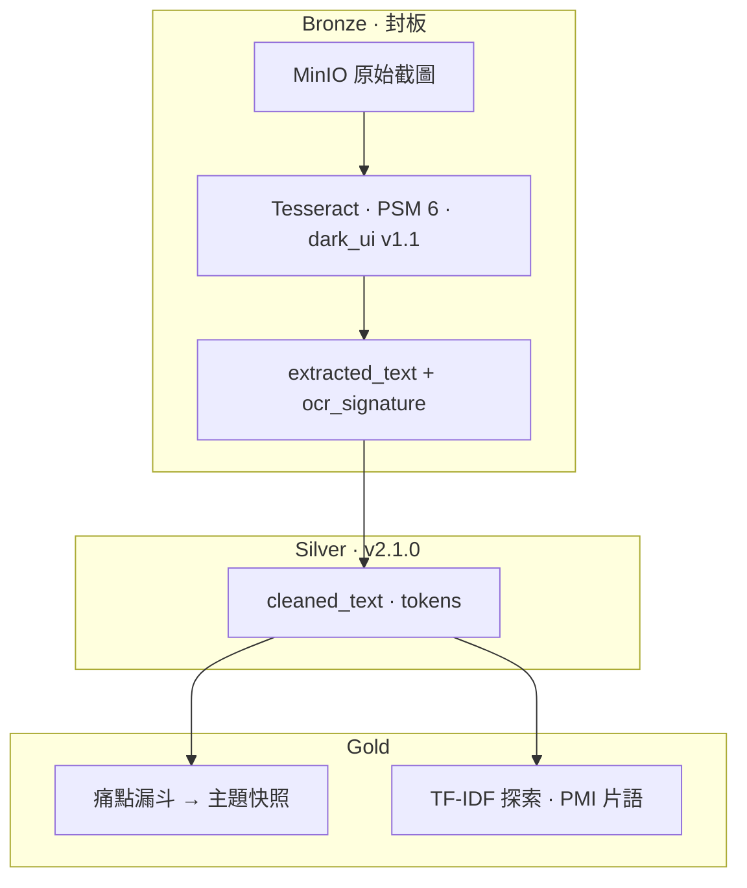

# 外送平台客訴截圖 · 商業痛點分析資料湖

**問題**：外送 App 客訴散落在截圖裡，難以結構化分析。  
**做法**：OCR → **Medallion（Bronze → Silver → Gold）** → 痛點主題與規則種子探索。  
**示範**：`dataset_id=drinks`（手搖飲，50 張深色 UI 截圖）→ **6 類痛點主題**、597 個 TF-IDF 探索詞。

技術：**Flask · PySpark 3.5 · Delta Lake · MinIO · Tesseract · Jieba · Docker**

---

## 亮點（30 秒版）

- **全線可 demo**：`docker compose up` → 首頁可看痛點主題快照與 TF-IDF 探索
- **銅層封板**：`PSM 6` + `dark_ui`（`pre=v1.1`），經 20 張樣本 A/B 定案（例：PSM 6 vs 11 關鍵詞 **9 vs 7**）；`ocr_signature` 可追溯；OCR 參數經 **broadcast** 傳至 Spark executor
- **銀層封板**：`SILVER_TRANSFORM_VERSION=v2.1.0`（CJK 去空格、emoji／洋文垃圾清洗）+ 三道品質閘門；**不**套用領域停用詞（留給 Gold）
- **Bronze 列級隔離**：Silver ETL 前三層熔斷（≤10% 僅隔離；>10% 軟熔斷擋核准；≥30% 硬停）；首頁顯示母體完整度（有效 OCR：analyzed/raw）
- **上傳僅截圖**：`POST /api/upload/images` 寫入前拒絕影片與假圖片（副檔名 + 檔頭）；不支援影片 OCR
- **金層雙軌**：`analytics_tokens` → 痛點漏斗（商業輸出）；`tfidf_exploration_tokens` → Phase A 探索（避免虛詞淹沒 Top）
- **管線守護神**：`python scripts/pipeline_guardian.py --dataset drinks` 比對銅銀簽名與金層辭典 hash（防改詞忘 bump）；詳見 `manifests/README.md`
- **變更有代價**：改 OCR 須 Bronze `overwrite`；只重跑 Silver **不會**更新 `extracted_text`（見決策紀錄）

**輸出怎麼看：** 首頁 **痛點主題快照** = 客訴結論；**TF-IDF** = 規則種子探索（非最終痛點）。

---

## 架構（摘要）



| 層級 | 做什麼 | 面試可強調 |
|------|--------|------------|
| **Bronze** | OCR 原文落盤，`ocr_signature` 版控 | PSM A/B 定案、前處理封板、broadcast 至 executor |
| **Silver** | 清洗 + Jieba 分詞，三道品質閘門 | 銀層不扣領域停用詞；`SILVER_TRANSFORM_VERSION` 驅動 MERGE；Bronze 隔離在 ETL 入口 |
| **Gold** | 規則式痛點分類 + 資料驅動探索 | 漏斗（撈網→過濾）與 TF-IDF **token 分流** |

管線以 `dataset_id` 設計，可擴充其他品類。

---

## 技術棧

Flask · PySpark 3.5 · Delta Lake 3.0 · MinIO（S3A）· Tesseract · Jieba · Docker

---

## 快速開始

1. 複製環境設定：`cp .env.example .env`（填入 MinIO 金鑰與位址）
2. 啟動（連外部 MinIO 時請改 `.env` 內 `MINIO_ENDPOINT`）：

```powershell
docker compose up --build
```

3. 開啟 **http://127.0.0.1:5000**，`dataset_id` 選 **drinks**

本機含 MinIO 一鍵示範：

```powershell
docker compose -f "docker-compose(new_minio).yml" up --build
```

管線頁：`/pipeline/bronze` → `/pipeline/silver` → `/pipeline/gold`

---

## 主要 API（精選）

| 用途 | 方法 |
|------|------|
| 健康檢查 | `GET /health` |
| 上傳截圖 | `POST /api/upload/images`（僅靜態圖；禁影片） |
| Bronze OCR | `POST /delta/ocr/bronze/run` |
| Bronze 子集 OCR | 同上 · `write_mode=merge` · `image_paths` |
| Silver ETL | `POST /delta/silver/ocr/run` |
| Gold ETL | `POST /delta/gold/run?dataset_id=drinks` |
| 一鍵至金層 | `POST /delta/pipeline/to-gold/run` |
| PSM A/B（不寫 Bronze） | `GET /test/ocr-psm` |

完整路由見 `app.py`。寫入類 API 可設 `ADMIN_TOKEN`（見 `.env.example`）。

---

## 設計決策（公開摘要）

OCR 封板參數、PSM A/B 結論、分層職責與變更檢查清單：

→ **[docs/OCR-決策紀錄.md](docs/OCR-決策紀錄.md)**

---

## 專案結構（精選）

| 路徑 | 說明 |
|------|------|
| `app.py` | Flask 路由與 API |
| `services/ocr_spark.py` | Bronze OCR 與前處理 |
| `services/media_validation.py` | 上傳媒體驗證（僅圖、禁影片） |
| `services/minio_upload.py` | 寫入 MinIO raw 影像 |
| `services/spark_service.py` | Spark / Delta ETL |
| `services/bronze_quarantine.py` | Bronze 列級隔離與三層熔斷 |
| `services/pain_funnel.py` | 痛點漏斗 |
| `services/text_tokens.py` | 銀層清洗與分詞 |
| `dic/` | 領域辭典（停用詞、Jieba、OCR 詞） |
| `tests/` | `pytest`（含 CI） |

---

## 開發與測試

```powershell
pip install -r requirements.txt -r requirements-dev.txt
pytest -q
```

Push / PR 至 `main` 或 `master` 時執行 GitHub Actions（`.github/workflows/ci.yml`）。

---

## 授權

個人作品集／學習專案；使用與再散布請自行評估依賴套件授權。

> 本 repo 目錄名 `flask_spark_delta_docker` 為歷史命名；Docker 容器名等亦可能沿用舊專案代號，不影響管線行為。
