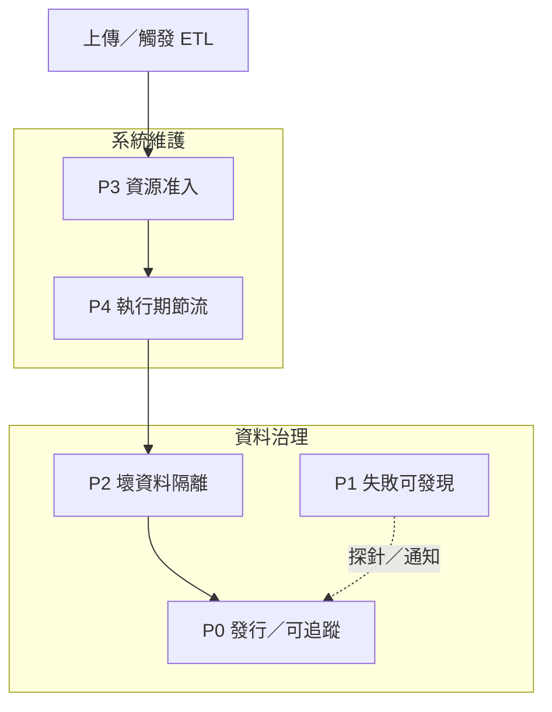

# OCR 與管線決策紀錄（公開摘要）

本文件為 **外送平台客訴截圖 · 商業痛點分析資料湖** 的對外決策摘要；完整除錯與維運手冊保留於本機，不納入版本庫。

---

## 速查：P 路線圖 vs 十項架構優化

> **兩套東西不要混**：**P0～P4** 是本專案自訂的「治理／護佑」路線（能不能發行、壞資料、OOM）；**十項** 來自外部建議（大型企業 Delta 成熟度），**多數現階段不必做**。

### P0～P4（本專案治理）— 程式面

| 階段 | 一句話 | 狀態 |
|:----:|--------|:----:|
| **P0** | 正式版／試看版、manifest、核准快照、可追溯 | ✅ |
| **P1** | 探針、新鮮度、通知（失敗可發現） | ✅ |
| **P2** | quarantine、熔斷、銀層閘門、merge history | ✅ |
| **P3** | Resource Guard（開工前擋過大／過忙） | ✅ |
| **P4** | 執行期節流（分批 OCR 等） | ✅ 分批、逾時、repartition 接口（預設 0 關） |

**尚未收尾（非漏做）**：drinks 營運驗收、黃金停用詞 v2。詳表 → [治理體系](#治理體系兩大區塊)。

### 十項架構優化（企業級 Delta 建議）— 要不要做？

來源：面試／架構討論之「百萬～千萬筆」視角；**你目前是單 dataset、約 50 張、單機 Spark**。

| # | 建議是什麼 | 你現在 | **現在有必要？** |
|:-:|------------|--------|:----------------:|
| 1 | Bronze 真 CDC（`version` 遞增、Append-only） | MERGE 覆寫；Silver 用 `ingestion_timestamp` 取最新 | **否** |
| 2 | Bronze 不 UPDATE：`history` + `latest_view` 分表 | merge 時可懶歸檔 `bronze/history/`；主表仍 MERGE | **部分**（已有 history；不必整表改 Append） |
| 3 | Silver **CDF** → Gold 只吃變更 | Gold 整表自 Silver 重算 | **否**（Gold 仍很小） |
| 4 | **Partition**（如 `dataset_id`） | 未 partition | **否**（僅 drinks 一個 id） |
| 5 | **OPTIMIZE / ZORDER / VACUUM** 排程 | 未制度化 | **否**（列數極少） |
| 6 | Delta **Checkpoint** 策略 | 未寫入手冊 | **否**（commit 數遠未成問題） |
| 7 | **Time Travel** Rollback SOP | 撤回發行用 `--revoke-snapshot`（清 manifest，不還原 Delta） | **文件可補**；程式不急 |
| 8 | **Schema Evolution** 明確策略 | Gold `mergeSchema` ✅；銀層 Schema 硬檢 | **部分**（已够用；可手冊寫一句） |
| 9 | 每列 Metadata（`git_commit`、`docker_image`…） | 已有 `ocr_signature`、ETL 版本；run 級 `etl_metrics` | **否**（run 級夠用） |
| 10 | **`quality_metrics` 表 + 30 天趨勢 Dashboard** | 銀層閘門 PASS/WARN + `etl_metrics.jsonl` | **否**（可選；量級不值得先做表） |

**結論（防過度設計）**：

- **十項全做 ≈ 過度設計**；與 P0～P4 **無關**，不阻塞 drinks 驗收。
- **現階段值得做的只有**：P 路線圖收尾（**drinks 驗收**）+ 第 7、8 項若要的話 **只寫手冊 SOP**，不必大改程式。
- **等觸發條件再做程式**：Bronze 要稽核多版 OCR（→ 1、2）、Gold 重算變慢（→ 3）、多 dataset／百萬列（→ 4～6）、品質要畫趨勢給主管（→ 10）。

---

## 實作現況（對照用）

| 項目 | 狀態 |
|------|------|
| 銅層封板（PSM 6 · dark_ui · `pre=v1.1`，50 張） | ✅ 已完成 |
| broadcast OCR 設定 + router 骨架（預設 `dark_ui`） | ✅ 已完成 |
| 銀層 `v2.1.0`（Lookaround CJK + emoji／垃圾清洗） | ✅ 已完成 |
| Gold 痛點漏斗 + TF-IDF 探索 token 分流 | ✅ 已完成 |
| 停用詞雙版本（黃金 `v1.0.0` / 探索 `dev`） | ✅ 已完成 |
| 管線守護神 + `manifests/drinks.json` | ✅ 已完成 |
| `approved_snapshot_at` 核准快照 | ✅ 已完成 |
| `/layers` 黃金／探索雙軌辭典 UI | ✅ 已完成 |
| 首頁發行版｜最新預覽（發行契約閉環） | ✅ 已完成 |
| 條件式新鮮度（圖片水位差）+ 外部 cron | ✅ 已完成 |
| 開發期撤回發行 `--revoke-snapshot` | ✅ 已完成 |
| 外部探針 + 可換通知後端（Discord／LINE Notify） | ✅ 已完成（`pipeline_probe.py`） |
| Compose `manifests`／`var` volume 掛載 | ✅ 已完成 |
| Compose 全檔 OCR 環境變數明列 | ✅ 三份 compose 已對齊 |
| per-row `ocr_signature` | ✅ UDF 依實際 profile 產生 |
| Bronze 子集 MERGE | ✅ `write_mode=merge` + `image_paths` |
| Bronze merge 前 history 懶歸檔 | ✅ `BRONZE_HISTORY_ON_MERGE`（第一次 merge 才建表） |
| Bronze 列級隔離 + 三層熔斷 | ✅ `bronze_quarantine.py` → `bronze/quarantine/` |
| 上傳源頭禁止影片 | ✅ `media_validation.py`（副檔名 + MIME + 檔頭） |
| Resource Guard（P3 三層資源保護） | ✅ `resource_guard.py` |
| 儲存健康（SDK vs S3A） | ✅ `/api/health/storage`、`/api/debug/storage-check` |
| raw 缺口列表 + 銅層 UI 對照 | ✅ `GET /api/bronze/raw-ingest-status` |
| **一鍵金自動補 raw 缺口 OCR** | ✅ `POST /delta/pipeline/to-gold/run`（`collect_missing_raw_image_paths`） |
| 上傳檔名剝前導 `_`（binaryFile 相容） | ✅ `minio_upload._sanitize_upload_basename` |
| Gold `topic_snapshot` mergeSchema | ✅ 欄位演進時自動合併 schema |
| preset router 子集調校（階段 4） | ❌ 未執行（**可選**；見下方待實作） |
| 執行期節流（P4） | ✅ | MinIO fallback 分批、逾時、`OCR_REPARTITION`（預設 0）；見下方 |

> **待完成項** → 見 **[治理體系（兩大區塊）](#治理體系兩大區塊)** 與各區塊「未完成」表。  
> **P vs 十項架構** → 見上方 **[速查](#速查-p-vs-十項)**。

---

## 治理體系（兩大區塊）

對話中將防線拆成兩套**互補、不重複**的治理；完整流程圖見本機手冊 **§6**。

| 區塊 | 管什麼 | 時機 |
|------|--------|------|
| **[資料治理](#一資料治理-data-governance)** | 資料對不對、能不能當**正式發行**、壞列去哪 | ETL **前後**與**讀取端** |
| **[系統維護](#二系統維護-system-operations)** | 會不會 OOM、能不能開工、執行中並行與逾時 | **開工前**與**執行中** |

> **用語**：討論時曾以「廚房／牛排排隊」比喻 OCR 記憶體與並行；**正式文件稱系統維護**（P3 資源准入 + P4 執行期節流）。

**勿混**：Bronze **熔斷 WARN**（資料治理）≠ Resource Guard **400**（系統維護／P3）≠ **OOM 137**（P4 未節流時仍可能發生）。

---

## 一、資料治理（Data Governance）

> **定位**：回答「這批資料可信嗎？對外該讀哪一版？壞列有沒有被隔離？」  
> **原則**：先補 **決策正確**（核准版、可追溯），再談叢集調優。

### 路線圖總表

| 階段 | 主題 | 狀態 | 摘要 |
|:----:|------|:----:|------|
| **P0** | 發行版／ETL 可追蹤 | ✅ 已完成 | 發行契約、核准快照、雙軌詞表、快照寫入 lexicon hash |
| **P1** | 失敗可發現 | ✅ 已完成 | 外部探針、條件式新鮮度、熔斷／探針通知 |
| **P2** | 壞資料隔離 | ✅ 已完成 | Bronze quarantine、三層熔斷、銀層品質閘門、merge history |
| **—** | 持續上傳閉環 | ✅ 已完成 | raw 缺口偵測 ✅；**一鍵金自動補 OCR** ✅ |
| **—** | 正式發行收尾 | ❌ 待做 | drinks 缺口圖驗收、黃金停用詞 v2（營運／詞表） |

### P0 — 發行版與可追溯（✅）

| 項目 | 狀態 | 模組／端點 |
|------|:----:|------------|
| 首頁 **發行版**｜**最新預覽**；無核准不靜默 fallback | ✅ | `release_contract.py`、`/` Dashboard |
| `approved_snapshot_at` + `--approve-snapshot`／`--revoke-snapshot` | ✅ | `pipeline_guardian.py`、`manifests/*.json` |
| 雙軌停用詞（黃金 `v1.0.0`／探索 `dev`） | ✅ | `lexicon.py`、`collect_gold_dual_lexicon()` |
| `topic_snapshot` 寫入 `release_lexicon_version`、`lexicon_content_hash` | ✅ | Gold ETL |
| 守護神：銅 `ocr_signature`、銀 `SILVER_TRANSFORM_VERSION`、金 lexicon hash | ✅ | `pipeline_guardian.py` |
| `mergeSchema` 支援 Gold 欄位演進 | ✅ | `topic_snapshot` 寫入 |
| ETL 指標可追溯 | ✅ | `etl_metrics.jsonl`、`GET /api/metrics/etl` |
| **ETL API 在守護神 FAIL 時硬擋** | ❌ **刻意不做** | 調參期須能跑「最新預覽」；發行靠核准版＋探針，見對話 Phase 1 決策 |
| **模型／訓練匯出硬閘門** | ❌ 未做 | 管線止于 Gold；下游訓練尚未接入 |

### P1 — 失敗可發現（✅）

| 項目 | 狀態 | 模組／端點 |
|------|:----:|------------|
| `GET /ready`、storage 健康 | ✅ | 部署／探針前置 |
| 外部探針 `pipeline_probe.py --strict` | ✅ | ready + guardian + freshness |
| 條件式新鮮度（圖片水位差） | ✅ | `pipeline_freshness_check.py`、`var/pipeline_heartbeat.json` |
| 探針／新鮮度 FAIL → Discord／LINE | ✅ | `PIPELINE_NOTIFY_BACKEND` |
| Bronze 軟／硬熔斷 → WARN／ALERT 通知 | ✅ | `pipeline_notify.py`（與 cron 探針互補） |
| Windows 排程包裝 | ✅ | `scripts/run_pipeline_probe.ps1` |
| 3am 自動排程 ETL | ❌ **不採用** | 本專案手動觸發；靠探針發現「忘了跑／跑掛」 |

### P2 — 壞資料隔離（✅）

| 項目 | 狀態 | 模組／端點 |
|------|:----:|------------|
| Bronze 列級隔離 → `bronze/quarantine/` | ✅ | `bronze_quarantine.py`（Silver ETL 前） |
| 三層熔斷（≤10%／軟>10%／硬≥30%）；軟熔斷擋核准 | ✅ | `BRONZE_QUARANTINE_*` |
| 銀層品質閘門（Schema／token 分佈／留存） | ✅ | `silver_quality.py` → 422 |
| merge 前 Bronze history 歸檔 | ✅ | `BRONZE_HISTORY_ON_MERGE`、`ocr_spark.py` |
| 上傳禁影片、檔名 sanitize | ✅ | `media_validation.py`、`minio_upload.py` |
| raw 缺口列表與 UI 對照 | ✅ | `raw_ingest_status.py` |
| **一鍵金自動補 raw 缺口** | ✅ | `collect_missing_raw_image_paths` → `to-gold` 內 `append` + `image_paths` |
| **Schema 突變 → Bad Data Path（整批不斷線）** | ❌ 未做 | 面試題提及；現況靠 Delta `mergeSchema`（Gold）與銀層 Schema 硬檢 |
| **Delta TIME TRAVEL／一鍵 Rollback** | ❌ 未做 | 發行撤回用 `--revoke-snapshot`（清 manifest，不刪 Delta 列） |

### 資料治理 — 未完成（必要優先）

| 優先 | 項目 | 為何必要 | 現況 |
|:----:|------|----------|------|
| **P1** | **drinks 缺口圖營運驗收** | 母體 N/50 與發行敘事 | ❌ 營運未跑（merge 能力已有） |
| **P2** | **黃金停用詞 v2 發行** | dev 滿意後正式 bump + manifest | ❌ 仍 `v1.0.0` |

---

## 二、系統維護（System Operations）

> **定位**：回答「現在能不能啟動 ETL？執行中會不會把 JVM 撐爆、任務會不會掛死？」  
> **分工**：**P3 資源准入**＝開工前檢查；**P4 執行期節流**＝執行中容量控制（與 P3 **疊加**，非重複）。

| | **P3 資源准入** | **P4 執行期節流** |
|---|----------------|------------------|
| **時機** | HTTP 請求／ETL **開工前** | OCR／Spark **執行中** |
| **主要防** | 一次太多圖、併發疊加、環境已滿還開工 | 單 job 並行過高、fallback 整批進 driver、無逾時 |
| **失敗** | HTTP **400** 繁中 | OOM 風險／任務掛死占槽 |

### P3 — 資源准入（Resource Guard，✅）

| 項目 | 狀態 | 變數／模組 |
|------|:----:|------------|
| Request：單次檔案數、單檔 ≤15MB | ✅ | `MAX_UPLOAD_FILES_PER_REQUEST`、`MAX_UPLOAD_MB` |
| Pipeline：Bronze 圖片數上限、ETL 併發槽 | ✅ | `MAX_BRONZE_OCR_IMAGES`、`ETL_MAX_CONCURRENT_JOBS` |
| Runtime：記憶體 % + 可用 MB 下限 | ✅ | `ETL_MEMORY_*`、`resource_guard.py` |
| Spark driver／executor 記憶體進 builder | ✅ | `SPARK_DRIVER_MEMORY` 等 |
| 總開關 | ✅ | `ETL_RESOURCE_GUARD_ENABLED` |
| Guard 拒絕時 **不發** LINE（刻意） | ✅ | 僅 HTTP 400；與熔斷通知分工 |

### P3.1／P4 — 執行期節流（✅）

| 項目 | 狀態 | 說明 |
|------|:----:|------|
| MinIO SDK **分批** fallback（degraded 時） | ✅ | `OCR_MINIO_BATCH_SIZE`；修「整批 50 張進 driver」 |
| `write_mode=merge` + `image_paths` 點讀 | ✅ | 子集不 list 全目錄 |
| API 回 `image_source`、`minio_batches_processed` | ✅ | 除錯用 |
| **執行逾時** | ✅ | `OCR_TIMEOUT_SECONDS`（單張 OCR）、`SPARK_JOB_TIMEOUT_SECONDS`（`pipeline_etl_slot`）；**0=關閉** |
| **OCR `repartition(N)`** | ✅ | `OCR_REPARTITION`；**預設 0 不強制**；擴量時設為 CPU 核心數 |
| **Docker `cpus`／Spark `local[N]`** | ❌ | 曾討論，尚未制度化 |
| **Guard 拒絕時 LINE + 冷卻**（可選） | ❌ | 非 OOM 主因 |

### P4 營運調校（⚠️ 未實測）

> **程式已接入**；下列數值因設備／圖量而異，**預設不改現況行為**，擴量前請在目標環境手動 smoke。

| 變數 | 預設 | 調校時機 |
|------|------|----------|
| `OCR_TIMEOUT_SECONDS` | 30（**0=關**） | 單張 OCR 過慢或逾時誤殺 |
| `SPARK_JOB_TIMEOUT_SECONDS` | 300（**0=關**） | 整段 ETL 掛死占滿 `ETL_MAX_CONCURRENT_JOBS` |
| `OCR_REPARTITION` | **0** | 並行 OCR 吃滿 CPU、擴量前 |

**手動 smoke（可選）**：暫設 `SPARK_JOB_TIMEOUT_SECONDS=10` 跑會卡住的 ETL → 應 HTTP 400；設 `OCR_REPARTITION=4` 跑 Bronze OCR → API `ocr_repartition_applied` 應為 4；完成後恢復 `.env` 預設。

### 系統維護 — 未完成（建議順序）

| 優先 | 項目 | 說明 |
|:----:|------|------|
| **P1** | **Guard LINE 通知** | 可選；營運可先看 400 訊息 |
| **P2** | **Docker cpus／Spark local[N]** | 擴量前再制度化 |

---

## 跨區塊待辦（討論用優先序）

| 順序 | 項目 | 歸屬 | 類型 |
|:----:|------|------|------|
| 1 | drinks 缺口圖驗收 | 資料治理 | 營運 |
| 2 | 黃金停用詞 v2 | 資料治理 | 詞表／manifest |
| 3 | 銅層 merge UI（指定範圍自動帶 path） | 資料治理 | 程式 |
| — | preset router 子集 AB | 銅層品質 | **可選** |
| — | 操作 `SOP.md` | 文件 | 可選 |

**可選／延後**：preset router AB、PaddleOCR 評估、Schema Bad Data Path、Delta Rollback、模型訓練閘門、Guard LINE。

---

## 防錯與治理體系（摘要）

> 完整對照表、流程圖、通知矩陣 → 本機 **`docs/架構與維運手冊.md` §6**。  
> **兩大區塊詳表** → 上方 **[資料治理](#一資料治理-data-governance)**、**[系統維護](#二系統維護-system-operations)**。

由外而內：**就緒／儲存 → P3 資源准入 → 上傳／讀圖 → 資料 P2 隔離熔斷 → 銀層閘門 → merge history → 資料 P0 發行／守護神 → 資料 P1 探針**。

| 層級 | 機制 | 失敗時 |
|------|------|--------|
| 運維 | `/ready`、外部 `pipeline_probe` | 503／排程告警 |
| 儲存 | SDK vs S3A（`degraded`＝易走 OCR fallback） | 除錯 API |
| P3 資源准入 | 檔數、圖片數、併發、記憶體 | HTTP 400 |
| 攝入 | 禁影片、binaryFile／MinIO fallback | 400／OOM 風險（fallback） |
| 管線 | Bronze quarantine 三層熔斷、Silver 品質閘門 | warning／422 |
| 發行 | `pipeline_guardian`、核准快照、發行版 Dashboard | FAIL／WARN |

**術語勿混**：「OCR 設定三層」（broadcast）≠「原圖讀取雙路徑」（binaryFile／SDK）。詳手冊 §6「術語辨析」。

---

## 分層職責

| 層級 | 職責 |
|------|------|
| **Bronze** | Tesseract OCR 原文（`extracted_text`），保留稽核用完整輸出 |
| **Silver** | 物理清洗（`cleaned_text`）→ Jieba 分詞（`tokens`）；版本由 `SILVER_TRANSFORM_VERSION` 驅動 MERGE 重算 |
| **Gold** | 領域 lexicon、痛點漏斗、TF-IDF 探索、PMI 片語 |

原則：**token 被刪難以救回；錯字可在 Gold 模糊匹配補救。**

**Gold 內部分流（雙版本詞表）：**

| 欄位 | 詞表 | 用途 |
|------|------|------|
| `analytics_tokens` | **黃金發行** `v1.0.0/` | 痛點漏斗（`effective_stop = 停用詞 − 痛點保護詞`）→ 主題快照 |
| `tfidf_exploration_tokens` | **探索測試** `dev/` | Phase A TF-IDF（探索停用詞 + 虛詞，**不**扣痛點保護） |

**治理原則**：對外簡報／模型只吃 manifest 核准的黃金發行版（`approved_snapshot_at` 對應的 `topic_snapshot`）；探索軌可持續調詞。首頁預設 **發行版**，可切換 **最新預覽**；無核准時不靜默 fallback 至 latest。

---

## 銅層 OCR 定案（drinks 深色 UI 截圖）

### 前處理 profile：`dark_ui`

| 參數 | 定案值 | 說明 |
|------|--------|------|
| `OCR_PSM` | **6** | 單一文字區塊；較少 emoji／圖示誤認垃圾 |
| `OCR_SCALE_MIN_SIDE` | **0** | 不放大；強制放大易使深色 UI 字糊（例：燕麥→蒸座） |
| `OCR_CONTRAST` | **1.5** | 灰階後對比 |
| `OCR_SHARPNESS` | **1.0** | 預設 |
| `OCR_BINARIZE` | **off** | 彩色／深色 UI 先不二值化 |
| `OCR_PREPROCESS_VERSION` | **v1.1** | 寫入 `ocr_signature` |

### PSM A/B 結論（各 20 張樣本，`scale=0`）

| 對照 | 結果 |
|------|------|
| 11 vs **6** | 6 勝：關鍵詞 9 vs 7；PSM 11 易產生 `BARE` 等洋文垃圾 |
| 4 vs **6** | 6 略優：關鍵詞平手，字數均值略高 |
| 13 vs **6** | 6 壓倒性勝：PSM 13 不適用整張手機截圖 |

**不再以 4、11、13 作為 drinks 主力 PSM。**

### 銅層封板與局部調校

- **全量 `overwrite` 只做一次**（2026-06-22，drinks 50 列）；此後視為封板。
- **preset router** 骨架已在 `ocr_spark.py`；`OCR_PRESET_ROUTER_ENABLED=false` 時一律 `dark_ui`。
- 封板後若少數爛圖需 `low_res` 等 profile：**禁止**第二次全表 overwrite；使用 **`write_mode=merge`** + **`image_paths`** 子集 Upsert。
- **merge 前自動歸檔**（`BRONZE_HISTORY_ON_MERGE=true`，預設開）：將被覆寫的舊列 append 至 `BRONZE_HISTORY_PATH`（懶建立；封板後若不 merge 則不佔空間）。純新增列不寫 history。API 回 `history_archived_rows`、`bronze_history_path`。
- `ocr_signature` 為 **per-row**（依 UDF 內實際 profile／前處理參數）。
- OCR 參數傳遞以 **`sc.broadcast(ocr_config)`** 為準；容器 `environment` 與 `spark.executorEnv` 為一致化備援。

---

## 銀層定案（`SILVER_TRANSFORM_VERSION=v2.1.0`）

- CJK 間 OCR 空格合併（例：珍珠 燕麥 → 珍珠燕麥）
- emoji／獨立洋文垃圾 token 清洗（保留 `line pay` 等白名單片語）
- 變更後只重跑 Silver → Gold，**不**重跑 Bronze

**CJK 去空格實作注意**：必須使用 **Lookaround** 正則 `(?<=[\u4e00-\u9fff])\s+(?=[\u4e00-\u9fff])`，且須在 **洋文白名單保護之後** 執行；不可用「刪除所有空白」，否則會誤殺 `line pay` 中間空格。

### Bronze 列級隔離與三層熔斷（Silver ETL 前）

| 項目 | 說明 |
|------|------|
| 模組 | `services/bronze_quarantine.py` |
| 列級規則 | `ocr_status`：empty｜ocr_error｜too_short｜noise（`BARE`）｜ok |
| 隔離表 | `BRONZE_QUARANTINE_PATH`（預設 `bronze/quarantine/`） |
| ≤10% | 壞列 quarantine，好列進 Silver |
| >10% 且 <30%（軟熔斷） | 好列仍進 Silver；擋 `--approve-snapshot`；WARN 通知 |
| ≥30%（硬熔斷） | 不進 Silver；ALERT 通知 |
| `MELT_MODE` | 預設 `soft`；`hard` 時 >10% 即硬停 |

與 `silver_quality` 分工：Bronze 擋單張 OCR 無效；Silver 擋整批語料健康度。

### 影像上傳（僅靜態圖、禁影片）

| 項目 | 說明 |
|------|------|
| 模組 | `services/media_validation.py`（`upload_file_bytes` 寫入前呼叫） |
| 允許 | PNG／JPEG／GIF／BMP／WEBP／TIFF |
| 禁止 | 影片副檔名、`video/*`、影片檔頭、假圖片檔頭 |
| 大小 | `MAX_UPLOAD_MB`（預設 15） |
| 繞過 | MinIO Console／CLI 直傳不經 API；日常請走 `/api/upload/images` |

---

## 已知限制與後續方向

| 項目 | 決策 |
|------|------|
| TF-IDF Top 雜詞 | 改 **`dic/stop_words/dev/`** 探索詞表；滿意後再合併進黃金 `v1.0.0/` + manifest |
| 銅層與 `.env` 脫節 | 變更 OCR 參數後須 Bronze 重寫 `extracted_text`；僅重跑銀層無效 |
| 銅層第二次全表 overwrite | **已取消**為預設路徑；改以 `merge` + `image_paths` |
| Bronze merge history | ✅ 懶建立；僅 merge 且 `image_path` 已存在時歸檔舊列 |
| per-row `ocr_signature` | ✅ 已實作 |
| 前處理 preset 分流 | 預設關閉；開啟前需子集 AB |
| PaddleOCR | 架構可接；ROI 偏低時維持 Tesseract 封板 |
| 影片上傳 | **不支援**；API 源頭拒絕；非經 API 直傳 MinIO 仍可能占空間 |

---

## 變更後重跑對照（摘要）

| 改了什麼 | 重跑 |
|----------|------|
| OCR 參數 / PSM / 前處理（**整批**，罕見） | Bronze **overwrite** → Silver → Gold |
| 少數圖需換 profile（封板後） | Bronze **merge**（`image_paths`）→ Silver → Gold |
| merge 覆寫前舊 OCR 留存 | 自動 append **`bronze/history/`**（`archived_at`、`archive_reason=pre_merge`） |
| `SILVER_TRANSFORM_VERSION` | Silver → Gold |
| 探索停用詞（`dev/`） | **Gold**（不更新 manifest） |
| 黃金發行停用詞（`v1.0.0/`）／痛點規則 | **Gold** + 更新 `manifests/*.json` |
| 核准痛點快照 | `pipeline_guardian.py --approve-snapshot`（寫入 `approved_snapshot_at` + `processed_image_count`；**Bronze 軟／硬熔斷期間拒絕**） |
| 撤回發行（開發期） | `pipeline_guardian.py --revoke-snapshot`（清 manifest 指標；不刪 Delta 快照列） |
| 新鮮度探針（cron） | `scripts/pipeline_freshness_check.py drinks` → `var/pipeline_heartbeat.json` |
| 外部探針 + 通知 | `scripts/pipeline_probe.py drinks --strict`（`PIPELINE_NOTIFY_BACKEND`） |
| Bronze 列級隔離 | Silver ETL 前；`BRONZE_QUARANTINE_PATH`；≤10% 僅隔離；>10% 軟熔斷（擋核准）；≥30% 硬熔斷 |
| 影像上傳 | `POST /api/upload/images`；僅靜態圖；影片／假圖片在寫入 MinIO 前拒絕 |

---

## 相關模組

- `services/ocr_spark.py` — 前處理、OCR、`ocr_signature`、router、broadcast
- `services/media_validation.py` — 上傳／OCR 共用媒體驗證（僅靜態圖、禁影片）
- `services/minio_upload.py` — 寫入 `raw/images/{dataset_id}/`
- `services/ocr_psm_ab.py` — PSM A/B 測試（`test/ocr_psm_ab/`）
- `services/text_tokens.py` — 銀層清洗與分詞
- `services/bronze_quarantine.py` — Bronze 列級隔離與三層熔斷（Silver ETL 前）
- `services/resource_guard.py` — P3 三層資源保護（Request／Pipeline／Runtime）
- `services/silver_quality.py` — 銀層整批品質閘門（Silver ETL 後）
- `services/lexicon.py` — Gold 雙版本停用詞與 TF-IDF 探索過濾
- `services/pipeline_guardian.py` — 管線守護神（銅銀品質、黃金 lexicon hash、核准前熔斷檢查）
- `services/pipeline_freshness.py` — 條件式新鮮度與 heartbeat
- `services/pipeline_notify.py` — 可換後端告警（Bronze 軟／硬熔斷、探針 FAIL；discord／line_messaging）
- `scripts/pipeline_probe.py` — 外部探針（ready + guardian + freshness）
- `manifests/drinks.json` — 黃金發行 manifest（含 `approved_snapshot_at`、`processed_image_count`）
- `templates/includes/dictionary_status_panel.html` — `/layers` 雙軌辭典狀態
